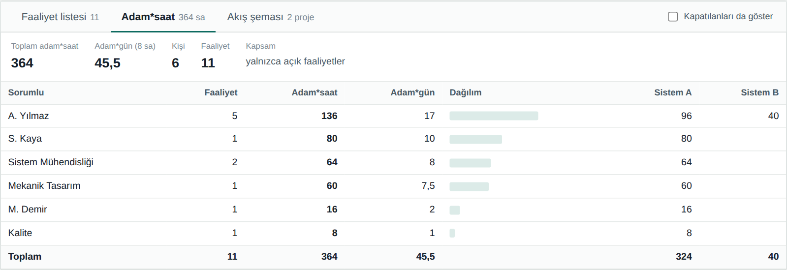

# Faaliyet Zaman Çizelgesi

Kurulum gerektirmeyen, internetsiz çalışan bir **faaliyet planlama ve takip aracı**.
Faaliyetleri tarihe göre bir zaman çizelgesine dizer, sorumlu ve projeye göre renklendirir, çakışmaları ve öncül–ardıl bağımlılıklarını gösterir.
Kapalı ağdaki, yönetici yetkisi olmayan bilgisayarlarda çalışmak üzere tasarlandı.


## Öne çıkanlar

- **Zaman çizelgesi:** Satırlar sorumluya veya projeye göre gruplanır, çubuklar sorumlu veya projeye göre renklenir. Hafta sonları gölgeli, bugün çizgisi işaretli.
- **Görünüm:** Tüm faaliyetler, çeyrek (3 ay) veya istenen tarih aralığı. **Sığdır** ile aralık ekrana oturur.
- **Çakışmalar:** Aynı sorumlu, aynı proje ya da ikisinden birine göre kesişen işler kırmızı taramayla işaretlenir. Ayrıntı penceresinde kiminle, hangi tarihlerde ve kaç gün çakıştığı görünür.
- **Öncül / ardıl bağımlılıkları:**
  - Bir çubuğu ya da akış şemasındaki bir kutuyu tutup başka birinin üzerine bırakmak bağ kurar.
  - Gecikme günü tanımlanabilir (ör. `+2`); döngü oluşturan bağlar reddedilir.
  - Bir işin tarihi değişince zincirdeki ardılların yeni tarihleri hesaplanır ve onayla uygulanır.
  - Oklar kutuların etrafından dolaşan dik açılı yollarla çizilir.
- **Akış şeması:** Proje bazlı. Aynı anda yürüyen işler aynı aşamada yan yana durur. Gri oklar aşama sırasını, yeşil oklar bağları gösterir.
- **Adam*saat:** Kişi bazında toplamlar, adam*gün karşılığı ve projelere dağılım.
- **Excel:** Sütun eşleştirmeli içe aktarma (başlık satırı ve tarih biçimi otomatik bulunur); faaliyetler, adam*saat ve çakışma sayfalarıyla dışa aktarma; boş şablon.
- **Görsel çıktı:** Çizelge ve akış şeması PNG olarak (yüksek çözünürlük, başlık ve açıklamalarla).
- **Kapatma:** Biten işler kapatılınca çizelgeden ve çakışma hesabından düşer, kayıt silinmez.

## İndirme ve çalıştırma

İki sürüm vardır; ikisi de aynı uygulamadır ve aynı proje dosyalarını açar.

| Sürüm | Dosya | Nasıl çalışır |
|---|---|---|
| **Masaüstü (Windows)** | `FaaliyetCizelgesi.exe` ([Releases](../../releases) sayfasından, ~7 MB) | Çift tıklayın. Kurulum ve yönetici yetkisi gerekmez. Kendi penceresinde, Windows menü çubuğu ve dosya pencereleriyle açılır. |
| **Tarayıcı** | [`app/faaliyet-cizelgesi.html`](app/faaliyet-cizelgesi.html) | Dosyayı indirip Edge veya Chrome ile açın. İnternet gerekmez. |

> Exe sürümü ekranı göstermek için Windows'ta yerleşik gelen **Microsoft Edge WebView2** bileşenini kullanır (Windows 10/11'de normalde yüklüdür).
> Exe dijital imzalı değildir; kurum güvenlik politikası engellerse HTML sürümünü kullanın.

## Hızlı başlangıç

1. Uygulamayı açın. Örnek bir proje görmek için [`ornekler/ornek-test-kampanyasi.fzc`](ornekler/ornek-test-kampanyasi.fzc) dosyasını **Dosya → Aç** ile açın.
2. Soldaki formdan faaliyet ekleyin ya da **Excel'den aktar** ile toplu yükleyin.
3. Bağ kurmak için çizelgede bir çubuğu tutup ardılı olacak çubuğun üzerine bırakın.
4. Bir çubuğa tıklayınca ayrıntı penceresi açılır: tarihler, bağımlılıklar ve çakışmalar.
5. **Kaydet** (`Ctrl+S`) ile projeyi `.fzc` dosyası olarak saklayın.

Ayrıntılı kullanım için: **[docs/KULLANIM.md](docs/KULLANIM.md)**

## Ekran görüntüleri

| Sürükleyerek bağ kurma | Faaliyet ayrıntısı |
|---|---|
|  |  |

| Akış şeması | Zincirleme tarih güncelleme |
|---|---|
|  |  |

| Adam*saat özeti |
|---|
|  |

## Depo yapısı

```
app/faaliyet-cizelgesi.html   Uygulamanın tamamı (tek dosya; tarayıcı ve exe için ortak kaynak)
desktop/                      Windows exe sarmalayıcısı (Go + WebView2) ve derleme betikleri
ornekler/                     Örnek proje dosyası
docs/                         Kullanım ve geliştirme belgeleri, ekran görüntüleri
assets/icon.png               Uygulama ikonu
```

Derleme ve mimari için: **[docs/GELISTIRME.md](docs/GELISTIRME.md)**

## Lisans ve üçüncü taraf bileşenler

- Excel okuma/yazma için [SheetJS (xlsx) 0.18.5](https://sheetjs.com) HTML'in içine gömülüdür — Apache License 2.0.
- Masaüstü sürüm [go-webview2](https://github.com/jchv/go-webview2) kullanır — MIT.
