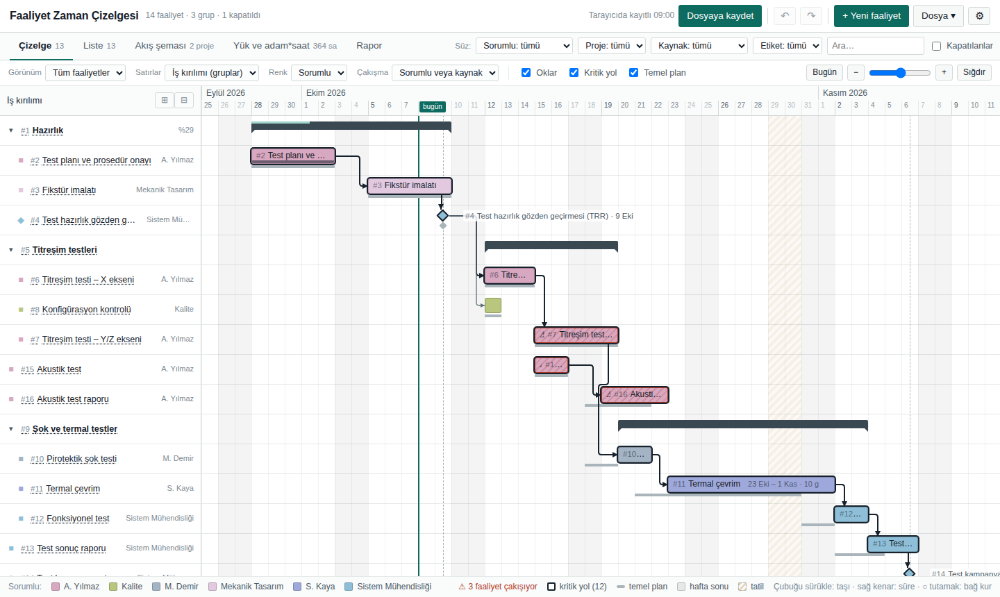
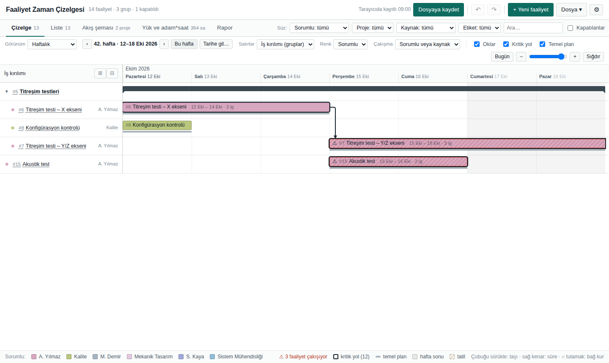
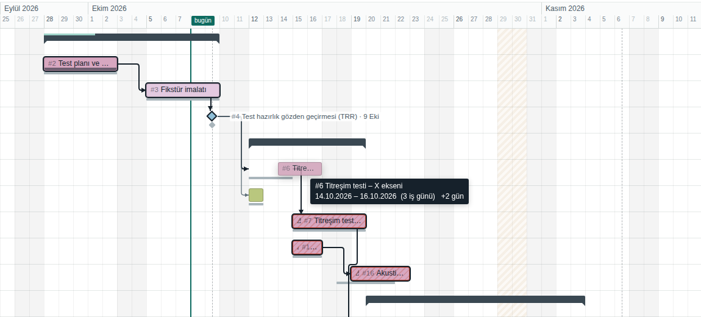
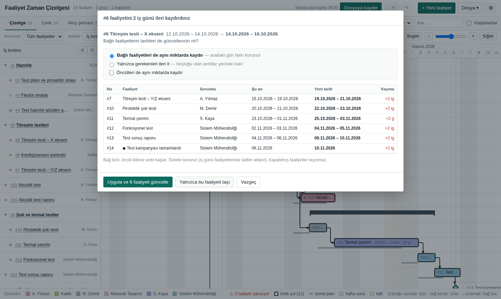
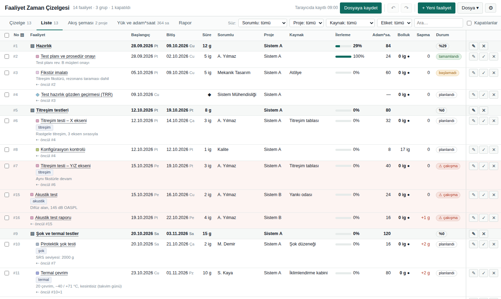
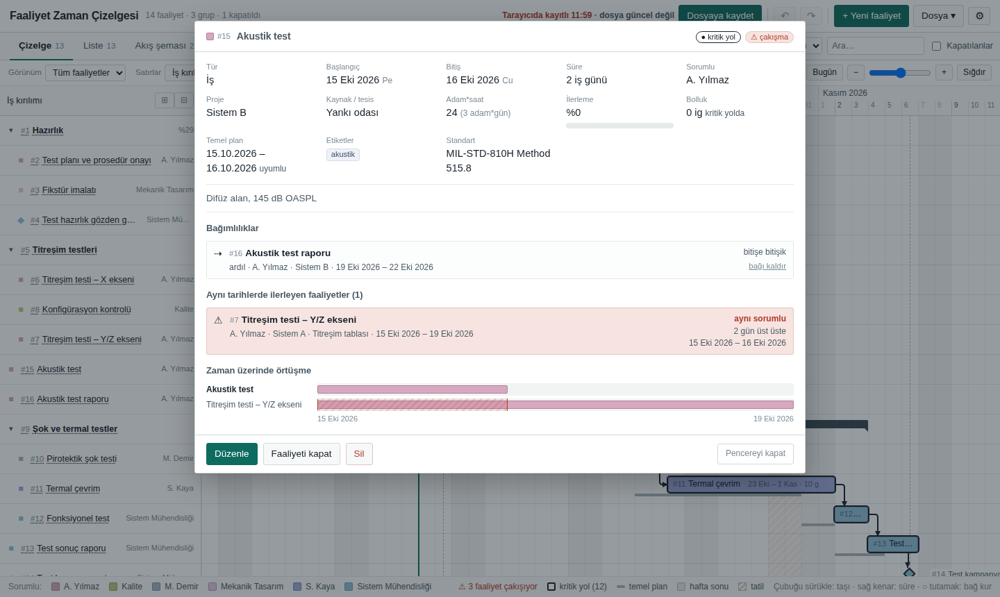
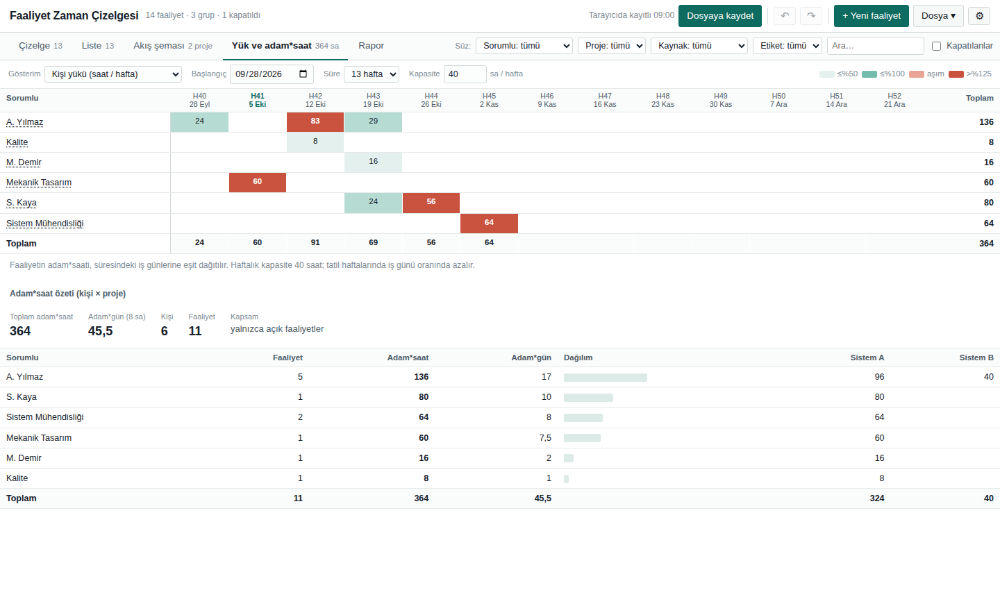
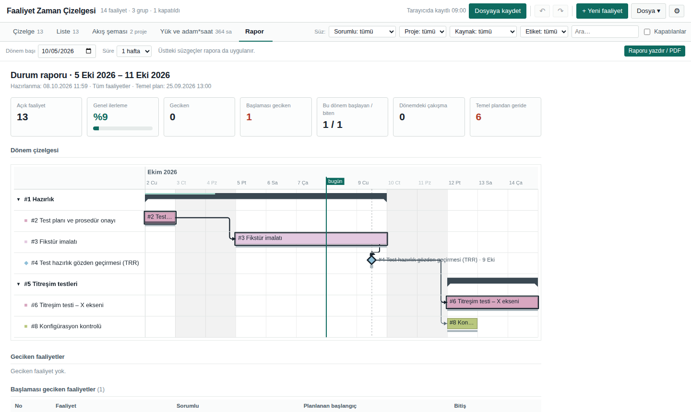
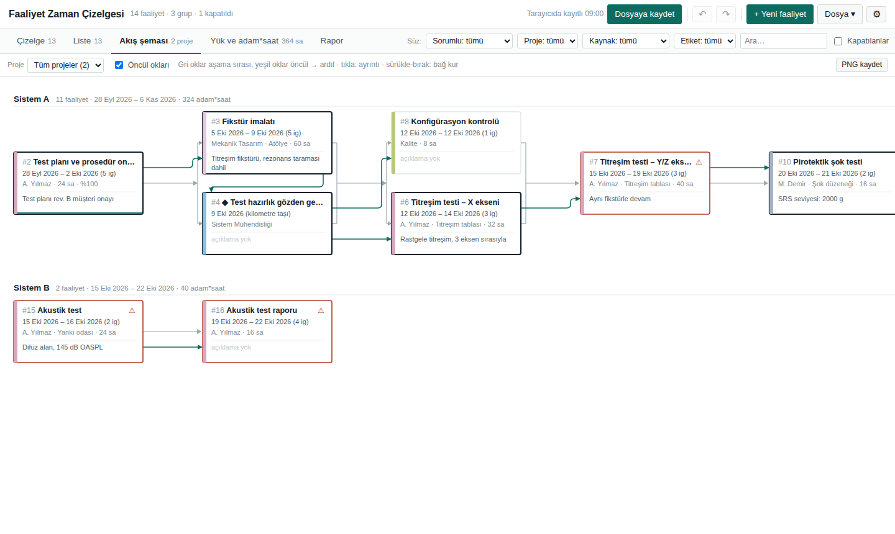
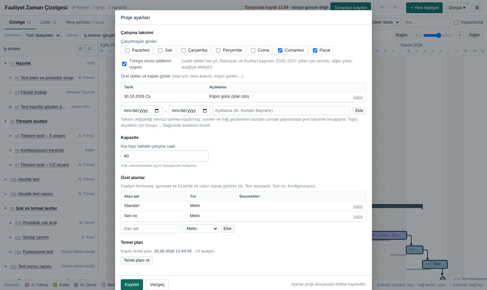

# Faaliyet Zaman Çizelgesi

Kurulum gerektirmeyen, internetsiz çalışan bir **faaliyet planlama ve takip aracı**.
Faaliyetleri iş günü takvimine göre bir zaman çizelgesine dizer; öncül–ardıl bağlarını, kritik yolu, çakışmaları, kişi ve kaynak yükünü gösterir, haftalık durum raporu üretir.
Kapalı ağdaki, yönetici yetkisi olmayan bilgisayarlarda çalışmak üzere tasarlandı.



## Öne çıkanlar

- **Haftalık görünüm:** Çizelgede hafta hafta ilerleme; 7 gün ekrana sığar, gün adları ve tarihler okunaklı.
- **Ekrana sığan düzen:** Çizelge, Liste, Akış şeması, Yük ve Rapor ayrı sekmelerde. Faaliyet formu sağdan açılan bir çekmecede.
- **Zaman çizelgesi:** Satırlar sorumluya, projeye, kaynağa ya da iş kırılımına (gruplar) göre. Çubuğu sürükleyerek taşıma, sağ kenarından süre değiştirme, ○ tutamaktan bağ kurma.
- **Çalışma takvimi:** Hafta sonları ve Türkiye resmi tatilleri atlanır; özel tatil ve kapalı günler eklenebilir. Kesintisiz işler için "takvim günü" seçeneği.
- **Öncül / ardıl bağları:** Gecikmeli bağ, döngü engeli, ihlal işaretleme. Bir faaliyet kaydırılınca bağlı faaliyetler aradaki gün farkı korunarak (onayla) kaydırılır. Oklar kutuların ve aşama çizgilerinin etrafından dolaşır.
- **Kritik yol ve bolluk**, **kilometre taşları**, **gruplar (iş kırılımı)**, **ilerleme yüzdesi**, gerçekleşen tarihler, **temel plan ve sapma**.
- **Kaynak / tesis** alanı ile test tezgâhı, oda, cihaz gibi paylaşılan kaynakların çakışma kontrolü.
- **Yük:** Kişi başı haftalık saat yükü (kapasite aşımı renkli) ve kaynak doluluğu; kişi × proje adam*saat özeti.
- **Rapor:** Seçilen dönem için gecikenler, başlayacak ve bitecek işler, kilometre taşları, kritik yol, çakışmalar; yazdırılabilir / PDF.
- **Geri al / yinele** (`Ctrl+Z` / `Ctrl+Y`), **toplu düzenleme**, **etiketler** ve **özel alanlar**.
- **Excel:** Sütun eşleştirmeli içe aktarma; tüm alanlarla dışa aktarma; boş şablon. Çizelge ve akış şeması **PNG** olarak.

## İndirme ve çalıştırma

İki sürüm vardır; ikisi de aynı uygulamadır ve aynı proje dosyalarını açar.

| Sürüm | Dosya | Nasıl çalışır |
|---|---|---|
| **Masaüstü (Windows)** | `FaaliyetCizelgesi.exe` ([Releases](../../releases) sayfasından, ~7 MB) | Çift tıklayın. Kurulum ve yönetici yetkisi gerekmez. Kendi penceresinde, Windows menü çubuğu ve dosya pencereleriyle açılır. |
| **Tarayıcı** | [`app/faaliyet-cizelgesi.html`](app/faaliyet-cizelgesi.html) | Dosyayı indirip Edge veya Chrome ile açın. İnternet gerekmez. |

> Exe sürümü ekranı göstermek için Windows'ta yerleşik gelen **Microsoft Edge WebView2** bileşenini kullanır (Windows 10/11'de normalde yüklüdür).
> Exe dijital imzalı değildir; kurum güvenlik politikası engellerse HTML sürümünü kullanın.

## Hızlı başlangıç

1. Uygulamayı açın. Örnek bir proje için [`ornekler/ornek-test-kampanyasi.fzc`](ornekler/ornek-test-kampanyasi.fzc) dosyasını **Dosya → Aç** ile açın.
2. **+ Yeni faaliyet** (`Insert`) ile faaliyet, kilometre taşı ya da grup ekleyin veya **Dosya → Excel'den aktar** ile toplu yükleyin.
3. Çizelgede çubuğu sürükleyerek taşıyın; sağdaki ○ tutamağı başka bir çubuğa bırakarak bağ kurun.
4. **⚙ Proje ayarları**'ndan çalışma günlerini, özel tatilleri ve özel alanları belirleyin.
5. **Dosya → Temel planı kaydet** ile planı dondurun; sonraki kaymalar sapma olarak görünür.
6. **Kaydet** (`Ctrl+S`) ile projeyi `.fzc` dosyası olarak saklayın.

Ayrıntılı kullanım için: **[docs/KULLANIM.md](docs/KULLANIM.md)**

## Ekran görüntüleri

| Haftalık görünüm |
|---|
|  |

| Çubuğu sürükleyerek taşıma | Bağlı faaliyetleri kaydırma |
|---|---|
|  |  |

| Liste ve toplu düzenleme | Faaliyet ayrıntısı |
|---|---|
|  |  |

| Yük ve adam*saat | Durum raporu |
|---|---|
|  |  |

| Akış şeması | Proje ayarları |
|---|---|
|  |  |

## Depo yapısı

```
app/faaliyet-cizelgesi.html   Uygulamanın tamamı (tek dosya; tarayıcı ve exe için ortak kaynak)
desktop/                      Windows exe sarmalayıcısı (Go + WebView2) ve derleme betikleri
ornekler/                     Örnek proje dosyası
docs/                         Kullanım ve geliştirme belgeleri, ekran görüntüleri
assets/icon.png               Uygulama ikonu
```

Derleme ve mimari için: **[docs/GELISTIRME.md](docs/GELISTIRME.md)** · Sürüm notları: **[CHANGELOG.md](CHANGELOG.md)**

## Lisans ve üçüncü taraf bileşenler

- Excel okuma/yazma için [SheetJS (xlsx) 0.18.5](https://sheetjs.com) HTML'in içine gömülüdür — Apache License 2.0.
- Masaüstü sürüm [go-webview2](https://github.com/jchv/go-webview2) kullanır — MIT.
